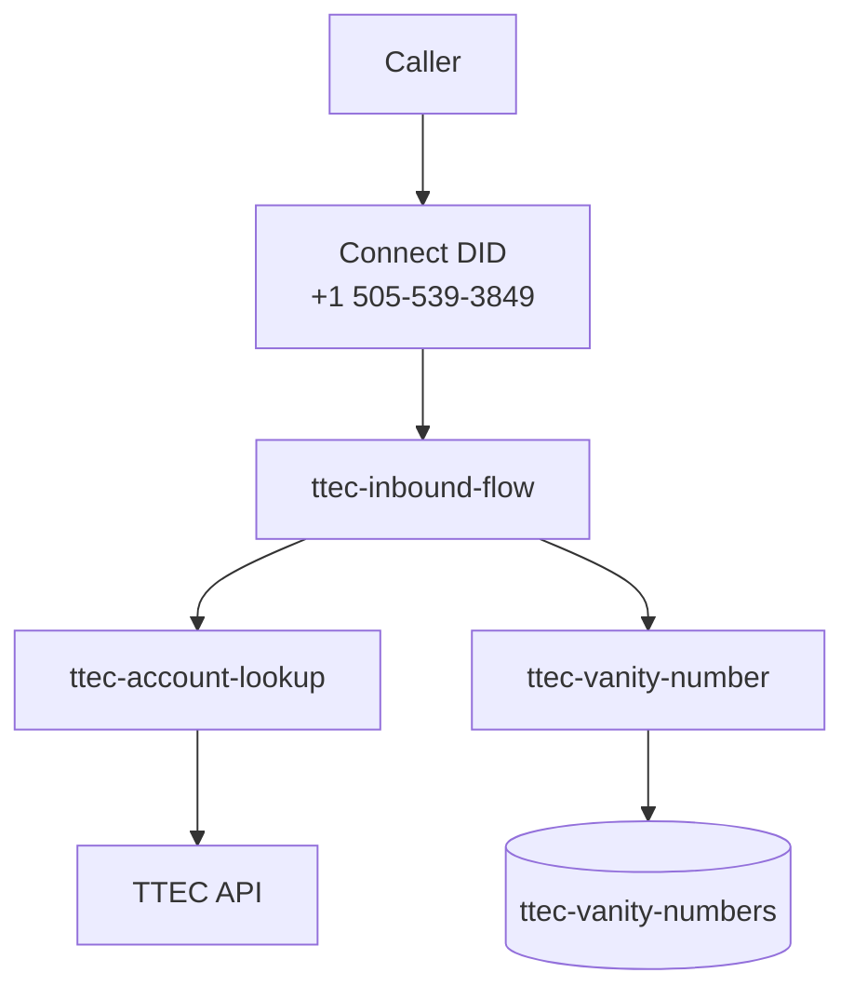

# TTEC Acme Financial — Amazon Connect Contact Center

AWS CDK project for the **TTEC Acme Financial Services** inbound IVR. Callers dial `+15055393849`, enter an account number, hear their balance, and receive vanity number suggestions.

## Architecture



## Stack resources (`TtecConnectStack`)

| Resource | Purpose |
|----------|---------|
| Connect instance | Contact center |
| Contact flow | `ttec-inbound-flow` — IVR logic from JSON |
| `ttec-account-lookup` | Calls TTEC API for account details |
| `ttec-vanity-number` | Generates vanity numbers, stores top 5 in DynamoDB |
| `ttec-vanity-numbers` | DynamoDB table for vanity results |
| Integration associations | Registers Lambdas with Connect |

The inbound DID (`+15055393849`) is **pre-provisioned** and associated with the contact flow outside CDK. Its ID is stored in [`infra/lib/config/project-config.ts`](infra/lib/config/project-config.ts).

## Project layout

```
├── contact_flows/ttec-inbound-flow.json   # IVR source of truth
├── lambda/
│   ├── account-lookup/src/handler.ts
│   └── vanity-number/src/handler.ts
├── infra/
│   ├── bin/app.ts
│   ├── lib/config/project-config.ts
│   ├── lib/constructs/
│   ├── lib/stacks/connect-stack.ts
│   └── test/connect-stack.test.ts
└── package.json
```

## Commands

```bash
export AWS_PROFILE=shaileshdemo

npm install
npm test              # CDK synth test + Lambda unit tests
npm run deploy        # Deploy stack
npm run deploy:lambda # Fast Lambda-only hotswap
```

| Change | Deploy with |
|--------|-------------|
| Lambda handler code | `npm run deploy:lambda` |
| Contact flow JSON | `npm run deploy` |
| CDK constructs / config | `npm run deploy` |

## Testing

**Unit tests** (Jest):

```bash
npm test
```

Covers account lookup (API success, 404, validation) and vanity number generation (scoring, DynamoDB writes, top-3 response).

**Live call test:**

1. `aws cloudformation describe-stacks --stack-name TtecConnectStack --query 'Stacks[0].Outputs' --output table`
2. Dial `+15055393849`
3. Enter account `108` and press `#` → Carlos, balance `892.15`

## Configuration

Edit [`infra/lib/config/project-config.ts`](infra/lib/config/project-config.ts):

- Connect instance alias prefix
- Contact flow name and JSON file
- Inbound phone number and ID
- TTEC API base URL (`https://d3ot99cmewuv1b.cloudfront.net`)
- Lambda and DynamoDB names

## API reference

- `GET /accountLookup?accountNumber={id}`
- `GET /allAccountNumbers`
