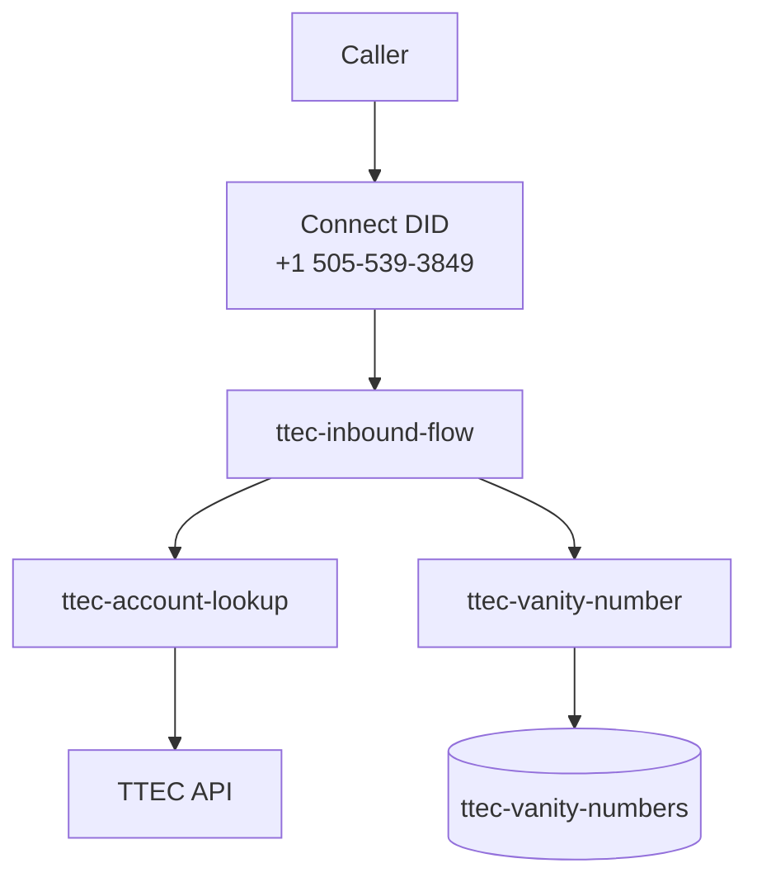
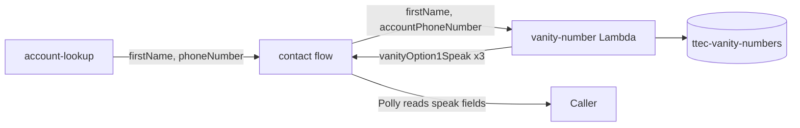

# TTEC Acme Financial — Amazon Connect Contact Center

AWS CDK project for the **TTEC Acme Financial Services** inbound IVR. Callers dial `+15055393849`, enter an account number, hear their balance, and receive vanity number suggestions.

## Architecture



## Stack resources (`TtecConnectStack`)

| Resource | Purpose |
|----------|---------|
| Connect instance | Contact center |
| Contact flow | `ttec-inbound-flow` — IVR logic from JSON |
| `ttec-account-lookup` | Calls TTEC API for account details |
| `ttec-vanity-number` | Generates vanity numbers, stores top 5 in DynamoDB |
| `ttec-vanity-numbers` | DynamoDB table for vanity results |
| Integration associations | Registers Lambdas with Connect |

The inbound DID (`+15055393849`) is pre-provisioned outside CDK. CDK re-associates it with `ttec-inbound-flow` on every deploy via `InboundPhoneAssociationConstruct`.

## Project layout

```
├── contact_flows/ttec-inbound-flow.json   # IVR source of truth
├── lambda/
│   ├── account-lookup/src/handler.ts
│   └── vanity-number/src/handler.ts
├── infra/
│   ├── bin/app.ts
│   ├── lib/config/project-config.ts
│   ├── lib/constructs/
│   ├── lib/stacks/connect-stack.ts
│   └── test/connect-stack.test.ts
└── package.json
```

## Commands

```bash
export AWS_PROFILE=shaileshdemo

npm install
npm test              # CDK synth test + Lambda unit tests
npm run deploy        # Deploy stack
npm run deploy:lambda # Fast Lambda-only hotswap
```

| Change | Deploy with |
|--------|-------------|
| Lambda handler code | `npm run deploy:lambda` |
| Contact flow JSON | `npm run deploy` |
| CDK constructs / config | `npm run deploy` |

## Testing

**Unit tests** (Jest):

```bash
npm test
```

Covers account lookup (API success, 404, validation) and vanity number generation (name personalization, scoring, DynamoDB writes, top-3 response).

## Vanity number logic (`ttec-vanity-number`)

After account lookup succeeds, the contact flow invokes the vanity Lambda with the caller's **first name** and **account phone number**. The Lambda builds vanity options from the same phone digits, prioritizing options that include or closely match the caller's name, then returns speakable phrases for Amazon Connect Polly.

### Flow



### Generation steps

1. **Normalize inputs** — Last 10 digits of the account phone; first name uppercased (e.g. `Carlos` → `CARLOS`).
2. **Name-based candidates** (`name-vanity.ts`) — Highest priority:
   - `1-{FIRSTNAME}-{last3}` / `1-{FIRSTNAME}-{last4}` (e.g. `1-CARLOS-847`)
   - `1-800-{FIRSTNAME}`, `1-{FIRST3}-{last4}`, `1-{FIRST4}-{last3}`
   - Keypad spelling of phone digits biased toward the name (`spellDigitsTowardName`)
   - Sliding windows over phone digits with name-similarity scoring
3. **Word-based candidates** (`vanity-engine.ts`) — Fallback using T9 dictionary matches (BANK, CASH, HELP, etc.) found in the phone digits.
4. **Rank & select** — Merge candidates, score by name similarity + word quality; keep top 5 in DynamoDB, return top 3 to the contact flow.
5. **Speakable output** — Each option gets a `*Speak` field with spaced letters and spoken digits (e.g. `one, C A R L O S, eight four seven`) so Polly does not mispronounce vanity strings.

### Lambda input (from Connect)

Passed via `LambdaInvocationAttributes` and contact attributes after account lookup:

```json
{
  "Details": {
    "Parameters": {
      "firstName": "Carlos",
      "accountPhoneNumber": "+12143473847"
    },
    "ContactData": {
      "Attributes": {
        "firstName": "Carlos",
        "accountPhoneNumber": "+12143473847"
      },
      "CustomerEndpoint": {
        "Address": "+15551234567"
      }
    }
  }
}
```

| Input | Source | Example |
|-------|--------|---------|
| `firstName` | Account lookup | `Carlos` |
| `accountPhoneNumber` | Account lookup | `+12143473847` |
| `callerPhoneNumber` | Connect caller ID | `+15551234567` |

### Lambda output (to contact flow)

Returned as `$.External.*` attributes. The contact flow reads `vanityOptionNSpeak` for Polly:

```json
{
  "vanitySuccess": "true",
  "vanityOption1": "1-CARLOS-847",
  "vanityOption2": "1-CARLOS-3847",
  "vanityOption3": "1-800-CARLOS",
  "vanityOption1Speak": "one, C A R L O S, eight four seven",
  "vanityOption2Speak": "one, C A R L O S, three eight four seven",
  "vanityOption3Speak": "one, eight zero zero, C A R L O S",
  "vanityOptions": "1-CARLOS-847, 1-CARLOS-3847, 1-800-CARLOS"
}
```

### DynamoDB record (top 5 stored per call)

Table: `ttec-vanity-numbers` — partition key `callerPhoneNumber`, sort key `rank`

```json
{
  "callerPhoneNumber": "+15551234567",
  "rank": 1,
  "vanityNumber": "1-CARLOS-847",
  "vanitySpeak": "one, C A R L O S, eight four seven",
  "firstName": "Carlos",
  "sourcePhoneNumber": "+12143473847",
  "score": 1400,
  "createdAt": "2026-09-01T05:20:00.000Z"
}
```

### Source files

| File | Role |
|------|------|
| `lambda/vanity-number/src/handler.ts` | Connect entry point, DynamoDB write, response mapping |
| `lambda/vanity-number/src/name-vanity.ts` | First-name personalization and scoring |
| `lambda/vanity-number/src/vanity-engine.ts` | Candidate merge, T9 word matching, ranking |
| `lambda/vanity-number/src/t9.ts` | Keypad mapping, speakable phrase formatting |

**Live call test:**

1. `aws cloudformation describe-stacks --stack-name TtecConnectStack --query 'Stacks[0].Outputs' --output table`
2. Dial `+15055393849`
3. Enter account `108` and press `#` → Carlos, balance `892.15`

## Configuration

Edit [`infra/lib/config/project-config.ts`](infra/lib/config/project-config.ts):

- Connect instance alias prefix
- Contact flow name and JSON file
- Inbound phone number and ID
- TTEC API base URL (`https://d3ot99cmewuv1b.cloudfront.net`)
- Lambda and DynamoDB names

## API reference

- `GET /accountLookup?accountNumber={id}`
- `GET /allAccountNumbers`
