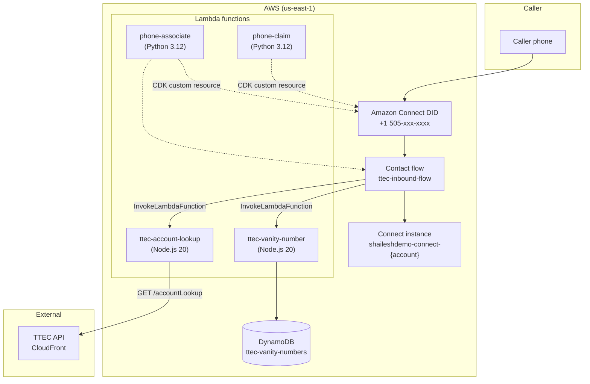
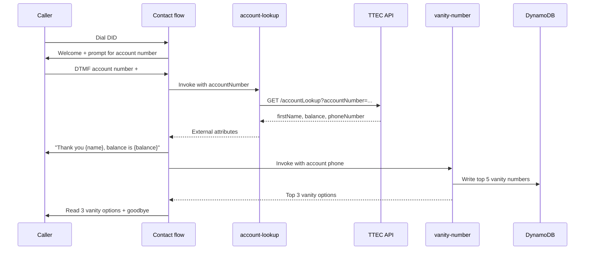

# TTEC Acme Financial — Amazon Connect Contact Center

AWS CDK project for the **TTEC Acme Financial Services** inbound contact center. Callers dial a DID, enter an account number, hear their balance, and receive vanity number suggestions generated from their account phone number.

---

## Architecture



### Call flow



---

## Project detail

| Requirement | Implementation |
|-------------|----------------|
| Amazon Connect inbound contact center | `ConnectInstanceConstruct` + inbound DID |
| Account lookup via TTEC API | `lambda/account-lookup` → `GET /accountLookup` |
| Greet caller by name, read balance | Contact flow `play-balance` block |
| Vanity number generation from account phone | `lambda/vanity-number` |
| Store top 5 vanity numbers in DynamoDB | Table `ttec-vanity-numbers` |
| Return top 3 vanity options to caller | Lambda returns `vanityOption1`–`3` |
| Infrastructure as Code | AWS CDK (`TtecConnectStack`) |
| Externalized contact flow JSON | `contact_flows/ttec-inbound-flow.json` |

**TTEC API base URL:** `https://d3ot99cmewuv1b.cloudfront.net`

- Account lookup: `GET /accountLookup?accountNumber={id}`
- List test accounts: `GET /allAccountNumbers`

---

## Directory structure

```
AWS_Connect_project/
├── contact_flows/              # Contact flow JSON (source of truth for IVR logic)
│   └── ttec-inbound-flow.json
├── lambda/
│   ├── account-lookup/         # Business: TTEC API account lookup
│   │   └── src/handler.ts
│   ├── vanity-number/          # Business: vanity generation + DynamoDB
│   │   └── src/handler.ts
│   ├── phone-claim/            # CDK custom resource: search + claim DID
│   │   └── index.py
│   └── phone-associate/        # CDK custom resource: phone ↔ flow
│       └── index.py
├── infra/
│   ├── bin/app.ts              # CDK app entry point
│   ├── cdk.json
│   ├── lib/
│   │   ├── config/project-config.ts
│   │   ├── constructs/         # Reusable CDK constructs
│   │   ├── stacks/connect-stack.ts
│   │   └── utils/
│   └── test/connect-stack.test.ts
├── package.json
└── README.md
```

---

## AWS resources (CDK stack: `TtecConnectStack`)

| Resource | Type | Purpose |
|----------|------|---------|
| Connect instance | `AWS::Connect::Instance` | Contact center (`shaileshdemo-connect-{account}`) |
| Inbound DID | `Custom::ConnectPhoneClaim` | Search + claim available US DID |
| Contact flow | `AWS::Connect::ContactFlow` | `ttec-inbound-flow` — full IVR logic |
| Phone association | `Custom::AssociatePhoneWithFlow` | Route DID to contact flow |
| Account lookup Lambda | `AWS::Lambda::Function` | `ttec-account-lookup` |
| Vanity number Lambda | `AWS::Lambda::Function` | `ttec-vanity-number` |
| Phone claim Lambda | `AWS::Lambda::Function` | Custom resource backend |
| Phone associate Lambda | `AWS::Lambda::Function` | Custom resource backend |
| Lambda registrations | `AWS::Connect::IntegrationAssociation` × 2 | Register business Lambdas with Connect |
| Vanity numbers table | `AWS::DynamoDB::Table` | `ttec-vanity-numbers` |
| IAM roles & policies | `AWS::IAM::Role` | Lambda execution + custom resource permissions |

**Stack outputs:** Connect instance ARN/alias, contact flow ARN, inbound phone number, Lambda ARNs, DynamoDB table name.

---

## Prerequisites

- Node.js 20+ (22 recommended)
- AWS CLI configured (`AWS_PROFILE` or default credentials)
- CDK bootstrapped in target account/region:
  ```bash
  npx cdk bootstrap aws://ACCOUNT_ID/us-east-1
  ```

---

## Commands

```bash
export AWS_PROFILE=shaileshdemo   # or your profile

npm install
npm run build                     # Compile CDK TypeScript
npm test                          # Synth + unit tests
npm run diff                      # Show pending infrastructure changes
npm run deploy                    # Deploy stack (CloudFormation)
```

### Fast, targeted deploys

CDK uses **content hashing** per asset. On `npm run deploy`, only resources whose inputs changed are updated in CloudFormation. You do not need to redeploy unchanged components.

| What you changed | What CDK updates | Fastest command |
|------------------|------------------|-----------------|
| `lambda/account-lookup/` or `lambda/vanity-number/` | Only that Lambda function | `npm run deploy:lambda` (hotswap, ~seconds) |
| `contact_flows/ttec-inbound-flow.json` | Only `AWS::Connect::ContactFlow` | `npm run deploy` |
| `lambda/phone-claim/` or `lambda/phone-associate/` | Only that custom-resource Lambda | `npm run deploy` |
| `infra/lib/**` (constructs, stack) | Affected CloudFormation resources | `npm run deploy` |
| Everything / before release | Full stack | `npm run deploy:all` |

**Lambda-only iteration (development):**

```bash
# Edit lambda/account-lookup/src/handler.ts or lambda/vanity-number/src/handler.ts
npm run deploy:lambda
```

`deploy:lambda` uses `cdk deploy --hotswap`, which pushes new Lambda code directly without a full CloudFormation update. Use `npm run deploy` for production-style changes (IAM, env vars, new resources).

**Contact-flow-only iteration:**

```bash
# Edit contact_flows/ttec-inbound-flow.json
npm run deploy
```

CDK re-synthesizes the template; CloudFormation updates only the contact flow resource.

---

## Testing a call

1. Get stack outputs:
   ```bash
   aws cloudformation describe-stacks --stack-name TtecConnectStack \
     --query 'Stacks[0].Outputs' --output table
   ```
2. Dial the **InboundPhoneNumber** output (e.g. `+15055393849`).
3. Enter a test account number (from `/allAccountNumbers`) and press `#`.
   - Example: account `108` → Carlos, balance `892.15`.

---

## Configuration

Edit [`infra/lib/config/project-config.ts`](infra/lib/config/project-config.ts):

- Connect instance alias prefix
- Contact flow name and JSON file
- Phone number country/prefix (`+1505` for New Mexico DIDs)
- TTEC API base URL
- DynamoDB table and Lambda function names

---

## Development notes

- Business Lambdas use `aws-cdk-lib/aws-lambda-nodejs` (`NodejsFunction`) with esbuild bundling per function.
- Contact flow Lambda ARNs are injected at deploy time via `Fn.join` (not `Fn.sub`) so `$.Attributes` references in the flow JSON are preserved.
- `GetParticipantInput` with `StoreInput: True` requires `InputValidation` in the flow JSON.
- Phone claiming uses `SearchAvailablePhoneNumbers` + `ClaimPhoneNumber` with fallback prefixes to handle inventory availability.
